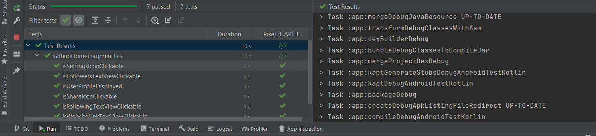
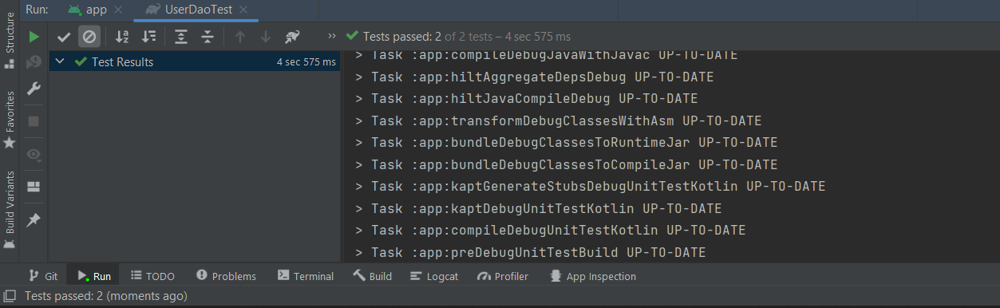
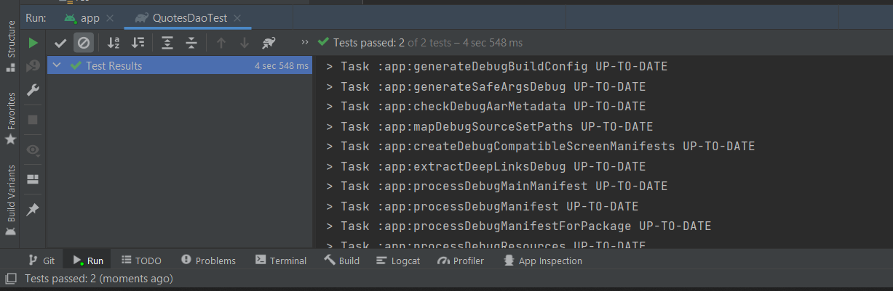
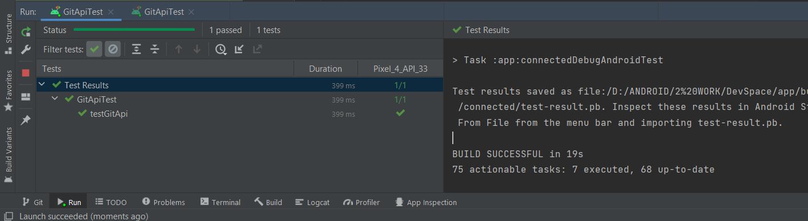
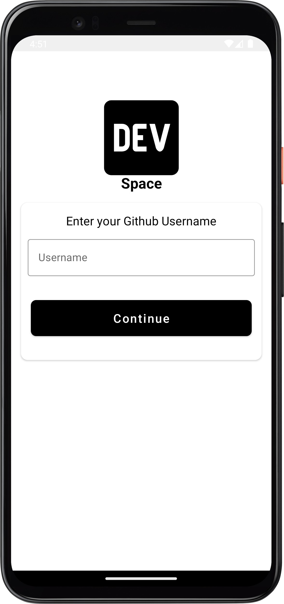
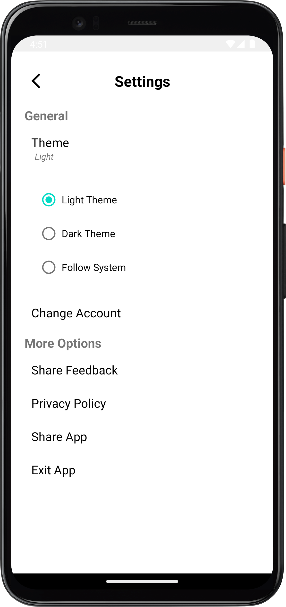
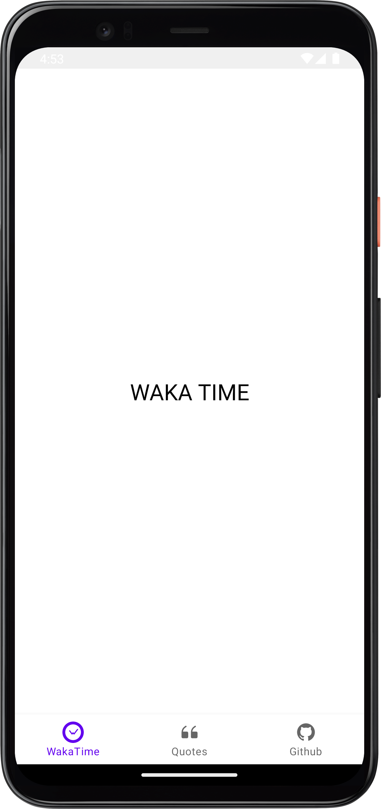
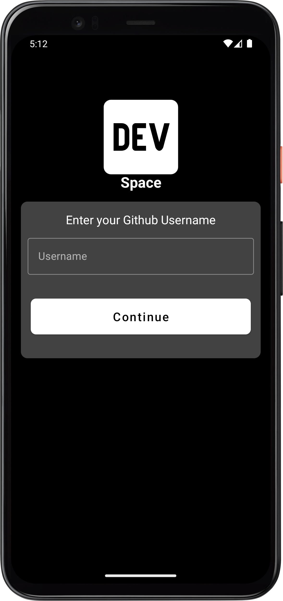
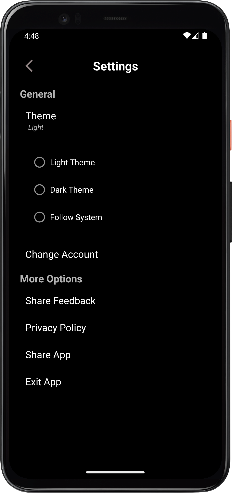
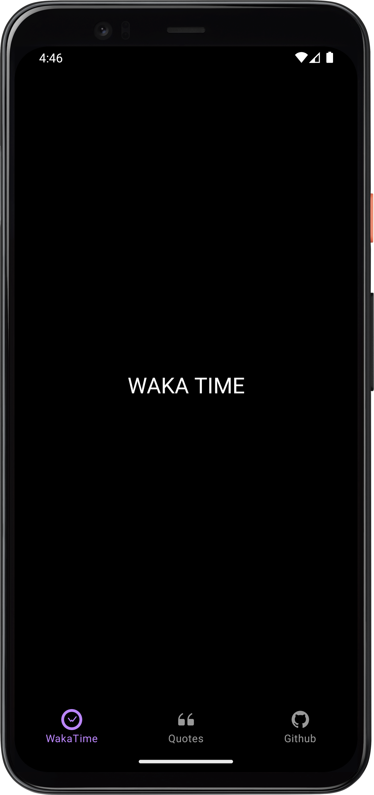

# DevSpace
An app that consumes the github, wakatime and programmerquotes apis, built following clean architecture principles and Test Driven Development(TDD) where tests are written before 
implementation.

## Architecture
<!---->
### 1.UI layer
The role of the UI layer (or presentation layer) is to display the application data on the screen. Whenever the data changes, either due to user interaction (such as pressing a button) or external input (such as a network response), the UI should update to reflect the changes.
The UI layer is made up of two things:

* UI elements that render the data on the screen. You build these elements using Views or Jetpack Compose functions.
* State holders (such as ViewModel classes) that hold data, expose it to the UI, and handle logic.

### 2.Data layer
The data layer of an app contains the business logic. The business logic is what gives value to your app—it's made of rules that determine how your app creates, stores, and changes data.
The data layer is made of repositories that each can contain zero to many data sources. You should create a repository class for each different type of data you handle in your app.

### 3.Domain Layer
The domain layer is an optional layer that sits between the UI and data layers.
The domain layer is responsible for encapsulating complex business logic, or simple business logic that is reused by multiple ViewModels. This layer is optional because not all apps will have these requirements. You should use it only when needed—for example, to handle complexity or favor reusability

## ScreenShots

 ### Tests
 



 
 ### Screens
 
   * Light
   
   &emsp;
&emsp;
&emsp;

    
    
  * Dark
  
  &emsp;
&emsp;
&emsp;


## Tech Stack
 - [Kotlin](https://kotlinlang.org/docs/reference/) - Kotlin is a cross-platform, statically typed, general-purpose programming language with type inference. Kotlin is designed to interoperate fully with Java, and the JVM version of Kotlin's standard library depends on the Java Class Library, but type inference allows its syntax to be more concise
 
 * [Jetpack Components:](https://developer.android.com/topic/architecture?gclid=Cj0KCQjw8O-VBhCpARIsACMvVLOH1satX45o9f4PMQ4Sxr7bG9myl6-KZL9nYda8PJsHV7m2uJL8bzgaAmqiEALw_wcB&gclsrc=aw.ds)
    * [View Model](https://developer.android.com/topic/libraries/architecture/viewmodel)-  store and manage UI-related data in a lifecycle conscious way.
    * [Lifecycle]( https://developer.android.com/topic/libraries/architecture/lifecycle) - Perform actions in response to a change in the lifecycle status of another component, such as activities and fragments.
    * [LiveData](https://developer.android.com/topic/libraries/architecture/livedata.html) - A lifecycle-aware data holder with the observer pattern
    * [Android KTX](https://developer.android.com/kotlin/ktx.html) - Android KTX is a set of Kotlin extensions that are included with Android Jetpack and other Android libraries. KTX extensions provide concise, idiomatic Kotlin to Jetpack, Android platform, and other APIs.
    * [AndroidX](https://developer.android.com/jetpack/androidx) - Major improvement to the original Android [Support Library](https://developer.android.com/topic/libraries/support-library/index), which is no longer maintained.

- [Retrofit](https://github.com/square/retrofit)- is a type-safe REST client for Android, Java and Kotlin, built as a powerful framework for consuming APIs

* [Dagger-Hilt](https://dagger.dev/hilt/)- a dependency injection library for Android that reduces the boilerplate of doing manual dependency injection in your project

* [Room](https://developer.android.com/topic/libraries/architecture/room.html) -  a persistence library provides an abstraction layer over SQLite for cache

* [Coroutines](https://developer.android.com/kotlin/coroutines) - a concurrency design pattern that you can use on Android to simplify code that executes asynchronously
* [Flow](https://developer.android.com/kotlin/flow)- In coroutines, a flow is a type that can emit multiple values sequentially, as opposed to suspend functions that return only a single value.
* 
* [CI/CD](https://codemagic.io/android-continuous-integration/) - Continuous integration systems let you automatically build and test your app every time you check in updates to your source control system. 

* [Glide](https://github.com/bumptech/glide) - Image Loader library.

* 


## How to use

To use this project you can [clone](https://github.com/Felix-Kariuki/DevSpace) it to your machine and: 
```text

add ACCESS_TOKEN = "YOUR ACCESS TOKEN HERE" in local.properties file

```

## Benefits of testing
Testing is an integral part of the app development process. By running tests against your app consistently, you can verify your app's correctness, functional behavior, and usability before you release it publicly.

You can manually test your app by navigating through it. You might use different devices and emulators, change the system language, and try to generate every user error or traverse every user flow.

However, manual testing scales poorly, and it can be easy to overlook regressions in your app's behavior. Automated testing involves using tools that perform tests for you, which is faster, more repeatable, and generally gives you more actionable feedback about your app earlier in the development process.


## Author
Felix Kariuki

<a href="https://www.buymeacoffee.com/felix.kariuki" target="_blank"></a>

Do Reach Out :

  * [Twitter](https://twitter.com/felixkariuki_)

  * [LinkedIn](https://www.linkedin.com/in/felix-kariuki/)
  
  
  ## License and Copyright

[MIT LICENSE](LICENSE)


```
MIT License

Copyright (c) 2022 Felix M Kariuki

Permission is hereby granted, free of charge, to any person obtaining a copy
of this software and associated documentation files (the "Software"), to deal
in the Software without restriction, including without limitation the rights
to use, copy, modify, merge, publish, distribute, sublicense, and/or sell
copies of the Software, and to permit persons to whom the Software is
furnished to do so, subject to the following conditions:

The above copyright notice and this permission notice shall be included in all
copies or substantial portions of the Software.

THE SOFTWARE IS PROVIDED "AS IS", WITHOUT WARRANTY OF ANY KIND, EXPRESS OR
IMPLIED, INCLUDING BUT NOT LIMITED TO THE WARRANTIES OF MERCHANTABILITY,
FITNESS FOR A PARTICULAR PURPOSE AND NONINFRINGEMENT. IN NO EVENT SHALL THE
AUTHORS OR COPYRIGHT HOLDERS BE LIABLE FOR ANY CLAIM, DAMAGES OR OTHER
LIABILITY, WHETHER IN AN ACTION OF CONTRACT, TORT OR OTHERWISE, ARISING FROM,
OUT OF OR IN CONNECTION WITH THE SOFTWARE OR THE USE OR OTHER DEALINGS IN THE
SOFTWARE.

```
